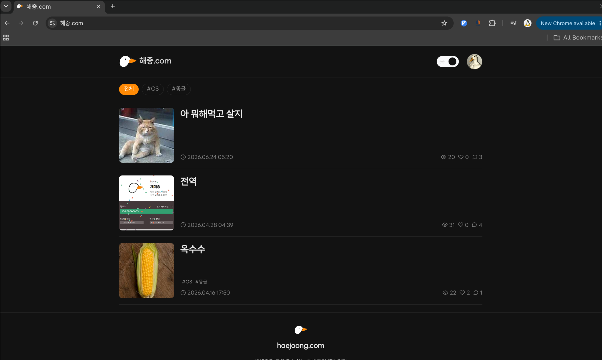

# 해중.com

나만 작성하는 내 개발 블로그.
AI한테 물어보면 다 나오는 뻔한 기술이나 이슈 따위를 적어두려고 만든 곳 X.

내가 느끼는 것들, 머리 속의 똥글들을 담기 위한 곳.

## 구경하러 가기

[해중.com](https://해중.com)

## 사용 기술

- Frontend: Typescript + ReactJS
- Backend: NestJS
- Infrastructure: Postgresql + Redis
- Production: Home server(Ubuntu server) + Docker

## 명령어

- 개발: pnpm run start:dev => http://localhost:5173
- 배포: make up
